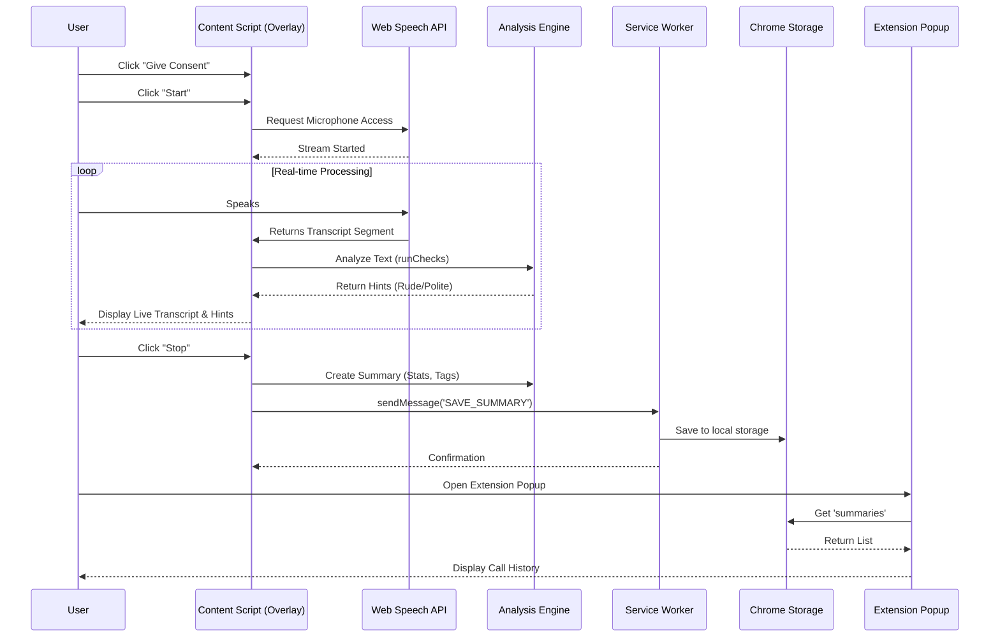

# Agent Call Auditor - Hackathon MVP

A Chrome Extension designed to analyze agent voice interactions in real-time for politeness, keywords, and sentiment, providing immediate feedback via an overlay.

## Features
- **Real-time Transcription**: Uses Web Speech API to transcribe agent audio.
- **Live Feedback**: Instant hints for rude phrases, politeness markers, and festival greetings.
- **Session Logging**: Saves call summaries (transcript, word count, analysis tags) locally.
- **History View**: View past call summaries in the extension popup.

## Installation
1. Clone or download this repository.
2. Open Chrome and navigate to `chrome://extensions/`.
3. Enable **Developer mode** (toggle in the top right).
4. Click **Load unpacked**.
5. Select the directory containing this project.

## Usage
1. Navigate to any webpage (the extension injects into `<all_urls>`).
2. You will see the "Agent Auditor" overlay in the bottom right.
3. Click **Give Consent** (simulated legal requirement).
4. Click **Start** to begin listening.
5. Speak into your microphone. The overlay will show live transcripts and hints.
6. Click **Stop** to end the session and save the summary.
7. Click the extension icon in the Chrome toolbar to view the history of saved calls.

## Architecture Flow

## Component Breakdown

### 1. `manifest.json`
Configuration file defining the extension's capabilities.
- **Permissions**: `storage` (saving history), `activeTab`, `scripting`.
- **Content Scripts**: Injects `content_script.js` into all pages.
- **Background**: Runs `service_worker.js`.

### 2. `content_script.js` (The Core)
Handles the main application logic within the web page context.
- **UI Injection**: Creates the floating overlay.
- **Speech Recognition**: Manages the `SpeechRecognition` instance.
- **Analysis**: `runChecks()` function scans text for keywords (e.g., "shut up", "thank you", "diwali").
- **State Management**: Tracks transcripts and handles Start/Stop actions.

### 3. `service_worker.js`
Background script acting as a bridge for persistent storage.
- Listens for `SAVE_SUMMARY` messages.
- Persists data to `chrome.storage.local`.

### 4. `popup.html` & `popup.js`
The user interface for viewing historical data.
- Fetches stored summaries.
- Renders a chronological list of past calls with stats (Word count, Rude/Polite tags).
